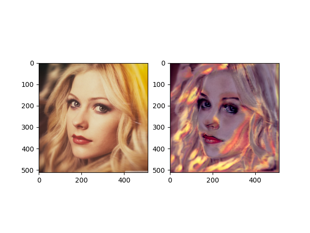

# CLIP 
<p align="center">

</p> 

# Introduction
CLIP implementation.
This is quick implementation of CLIP (Contrastive Language-Image Pre-Training).
CLIP can do projection sentence and image to same dimention and compaire them.

# Results
<p align="center">

</p> 


# Usage
```
|________ dataset
    |________ YOUR_DATASET_NAME
        |________ Image
        |    |_______ 2939475047_84585ea45c.jpg
        |    |_______ 3229913073_e7857a5966.jpg
        |    |_______ ...
        |________captions.txt
```

## Requirements
* python 3.8.13
* pytorch 1.11.0
* albumentations 1.1.0
* transformers 4.20.1
* timm 0.4.12
* cuda 10.2


## Datasets
Dataset(image-caption) pair for training and validation is made from Flickr 8k dataset(https://www.kaggle.com/datasets/adityajn105/flickr8k).
Its collection for sentence-basead image description and search, consist of 8000 images that are each paired.
The pair is chosen from six differenct original Flickr group, and tend not to contain any well-kwnon peple or locations.

You can use download dataset using kaggle command
```
> kaggle datasets download -d adityajn105/flickr8k
```
and unzip them.
```
> unzip flickr8k.zip -d {YOUR_DATASET_PATH}
```


<p align="center">

</p> 

## Train
Construction...

## Inference
```
> python main.py --inference --dataset {YOUR_DATASET_PATH}
```

# References
- [1] Open-AI CLIP 
https://github.com/moein-shariatnia/OpenAI-CLIP
- [2] CLIP-tutorials
https://towardsdatascience.com/simple-implementation-of-openai-clip-model-a-tutorial-ace6ff01d9f2
- [3] Flickr 8k Dataset
https://www.kaggle.com/datasets/adityajn105/flickr8k